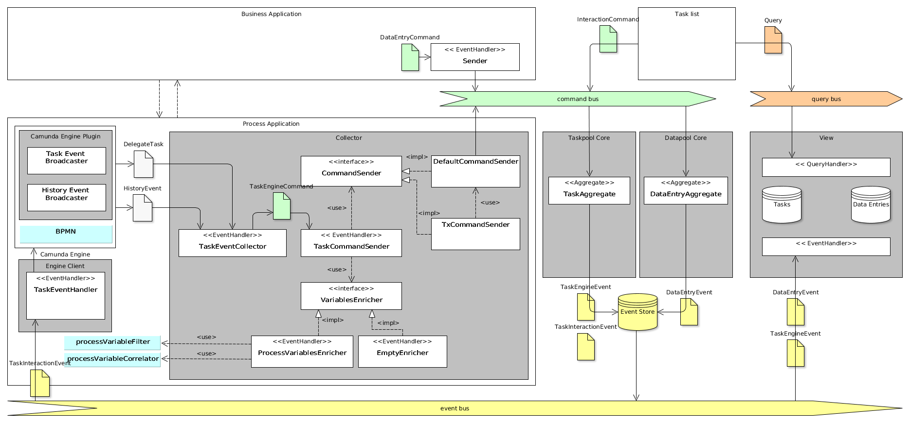

# Camunda BPM Taskpool

 

A component for pooling Camunda BPM user tasks with business data for performance queries.

## Motivation

In the last five years, I built a custom task list for different customers about six times. 
Most of them were built based on Single Page Application (SPA) technologies, but some were 
using server-side rendered views. It turned out that some of the issues occurred every time during the implementation. 

These were:

  - coping with performance issues of the `TaskService` by the big amount of tasks available 
  - creating high-performance custom queries for pre-loading process variables for tasks
  - creating high-performance custom queries to pre-load business data associated with the process instance
  - high-performance re-ordering (sorting) of user tasks
  - high-performance retrieving a list of tasks from several process engines
  - repetitive queries with same result

Many of those issues have to do with the fact that data on single task is written only one or two times, but is read many times of times (depending on the user count). 
For systems with a big amount of users this becomes a serious performance issue if not addressed. One of the possible solutions to most of those issues listed above 
is to create a special component, which has a read-optimized representation of tasks and is pre-loads tasks from the `TaskService`. In doing so, it decouples 
from the `TaskService` by the costs of loosing the strong consistency (and working with eventual-consistent task list), but allows for serving a high amount 
of queries without any performance impact to the process engine itself.

The goal of this project is to provide such component as a library, to be used in the integration layer between the Camunda BPM engine and the task list application. 

## Features

  - mirroring tasks: provides a list of tasks in the system including all task attributes provided by Camunda BPM Engine
    
  - reacts on all task lifecycle events fired by the engine
   
  - high performance queries: creates of read-optimized projections 
  including task-, process- and business data
  
  - centralized task list: running several Camunda BPM Engines in several applications 
  is standard for larger companies. From the user's perspective, it is not feasible 
  to login to several task lists and check for relevant user tasks. The demand for the 
  centralized task-list arises and can be addressed by `camunda-bpm-taskpool` 
  if the tasks from several process engines are collected and transmitted over the network.
  
  - data enrichment: all use cases in which the data is not stored in the process result 
  in a cascade of queries executed after the task fetch. The task itself has only the 
  information of the `executionId`, so you have to query the `RuntimeService` 
  for the execution, load some variables from it and query external systems for further values. 
  Another approach is presented in the post from Jan Galinski  
  (https://blog.holisticon.de/2017/08/prozess-und-business-daten-hand-in-hand-mit-camunda-und-jpa/), 
  but still results in a query on the task fetch. In contrast to that, 
  the usage of the `camunda-bpm-taskpool` with a data enrichment plugin mechanism 
  (allowing to plug-in some data enricher on task creation) would allow for caching the additional 
  business data along with the task information, instead of querying it during task fetch.  

## Solution Idea

## Components

  - Camunda Engine Eventing Plugin
  -  Camunda Engine Interaction Client
  - [Taskpool Collector](taskpool/taskpool-collector/docs/collector.adoc)
  - Datapool Sender
  - Taskpool Core
  - Datapool Core
  - Simple View
  - Taskpool Cockpit
  - Tasklist (example)

## Working Example

See our [Sample Process Application](examples) (including a simple tasklist implementation for demonstration purposes)

## Further outlook

This library serves as a foundation of several follow-up projects and tools:

  - Skill-based-routing: based on information stored in the taskpool, a skill-based routing for task assignment can be implemented.
  - Workload management: apart from the operative task management, the workload management is addressing issues like dynamic task assignment, optimal task distribution, assignment based on presence etc.  For doing so, a task pool to apply all these rules dynamically is required and the `camunda-bpm-taskpool` component can be used for that.
 

## Contribution

If you want to contribute to this project, feel free to do so. Start with [contributing guide](/docs/contributing.adoc).

