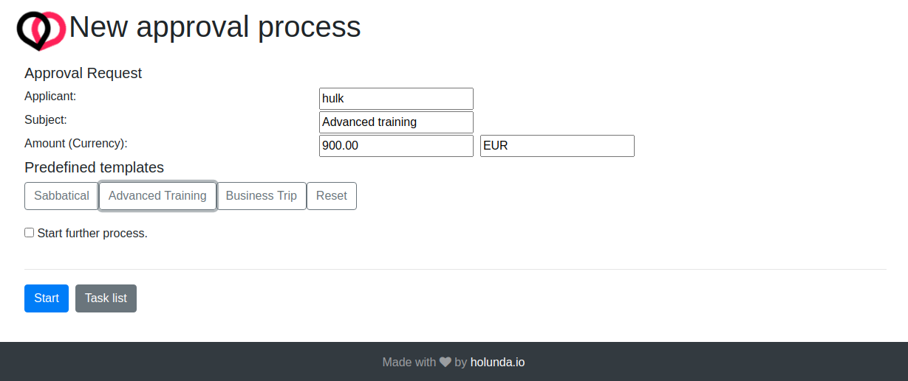
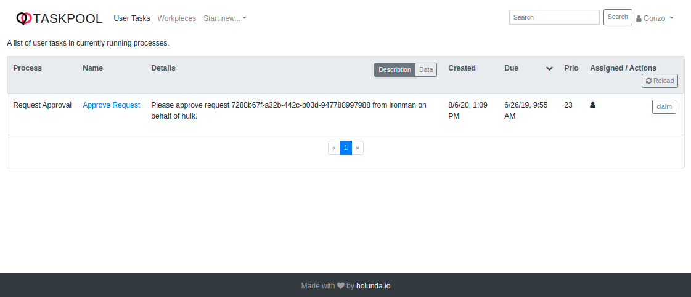
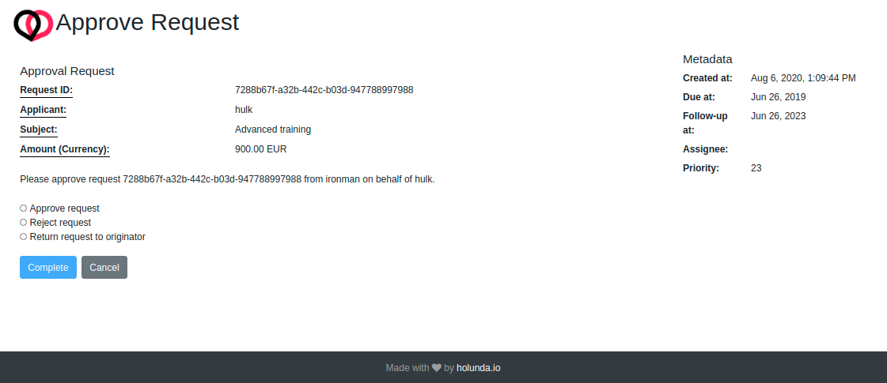
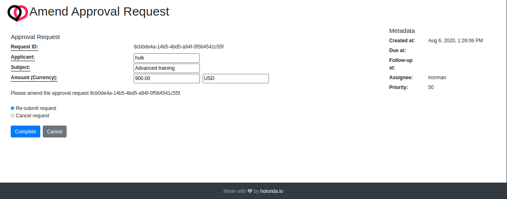

Along with library modules several example modules and applications are provided, demonstrating the main features of the solution.
This includes a series of example applications for usage in different [Usage Scenarios](./scenarios/). They all share the same
business process described in the next section.

## Business context: Approval

Take a look on the process model above. Imagine you are building a system that responsible for management of all approval requests
in the company. Using this system, you can submit requests which then get eventually approved or rejected. Sometimes, the __approver__
doesn't approve or reject, but returns the request back to the __originator__ for correction (that is the person, who submitted the request).
Then, the __originator__ can amend the request and resubmit it or cancel the request.

An approval request is modelled in the following way. The __subject__  describes what the request is about, the __applicant__ is the
person whom it is about (can be different from __originator__). Finally, the __amount__ and __currency__ denote the costs of the request.
All requests must be stored for compliance purposes.

The request is initially created in `DRAFT` mode. It gets to state `IN PROGRESS` as soon as the process is started and will
eventually get to `ACCEPTED` or `REJECTED` as a final state.

For sample purposes two groups of users are created: The Muppet Show (`Kermit`, `Piggy`, `Gonzo` and `Fozzy`) and The Avengers (`Ironman`,
`Hulk`).  `Gonzo` and `Fozzy` are responsible for approvals.

## Process Run

Let's play the following run through this process model.

- `Ironman` submits an Advanced Training request on behalf of `Hulk`
- The request costs are provided in wrong currency and `Gonzo` returns the request to `Ironman` for correction (EUR instead of USD)
- `Ironman` changes the currency to USD and re-submits the request
- `Gonzo` is out of office, so `Fozzy` takes over and approves the request

## Running Examples

To run the example please consult the [Usage Scenarios](./scenarios/) section.

TIP: Since the process application includes Camunda BPM engine, you can use the standard Camunda webapps by navigating
to [http://localhost:8080/camunda/app/](http://localhost:8080/camunda/app/).
The default user and password are `admin / admin`.

## Story board

The following storyboard can be used to understand the mechanics behind the provided implementation:

TIP: In this storyboard, we assume you started the single node scenario and the application runs locally
on http://localhost:8080. Please adjust the URLs accordingly, if you started differently.

- To start the approval process for a given request open your browser and navigate to the `Example Tasklist`:
[http://localhost:8080/taskpool/](http://localhost:8080/taskpool/). Please note that the selected user is `Ironman`.

- Open the menu (`Start new...`) in and select 'Request Approval'. You should see the start form for the example
approval process.

- Select `Advanced Training` from one of predefined templates and click _Start_. The start form will disappear and redirect back to
the empty `Tasklist`.

- Since you are still acting as `Ironman` there are nothing you can do here. Please switch the user to `Gonzo`
in the top right corner and you should see the user task `Approve Request` from process `Request Approval`.

- Examine the task details by clicking _Data_ tab in _Details_ column. You can see the data of the request correlated to
the current process instance.

- Click on the task name and you will see the user task form of the `Approve Request` task. Select the option
`Return request to originator` and click complete.

- Switch to `Workpieces` and you should see the request business object. Examine the approval request by clicking
_Data_, _Audit_ and _Description_ tabs in _Details_ column.

- Change user back to `Ironman` and switch back to the `Tasklist` and open the `Amend request`task. Change the currency to
`USD` and re-submit the request.

- Change user back to `Fozzy`, open the `Approve Request` task and approve the request by selecting the appropriate option.

- Switch to `Workpieces` and you should still see the request business object, even after the process is finished. Examine the approval
request by clicking _Data_, _Audit_ and _Description_ tabs in _Details_ column.
