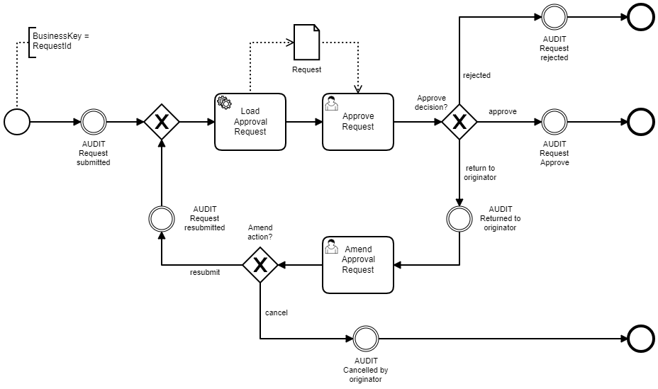
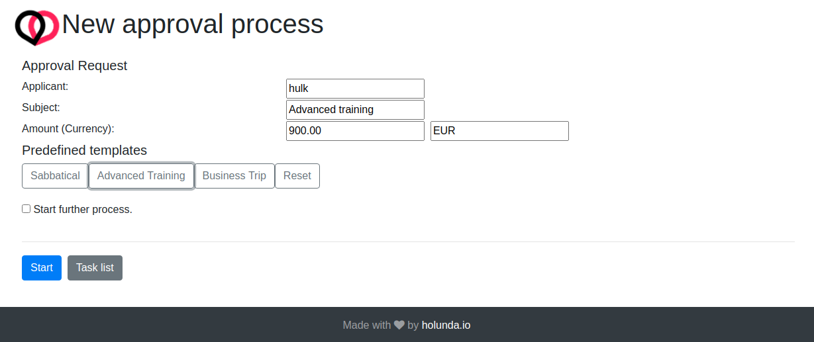
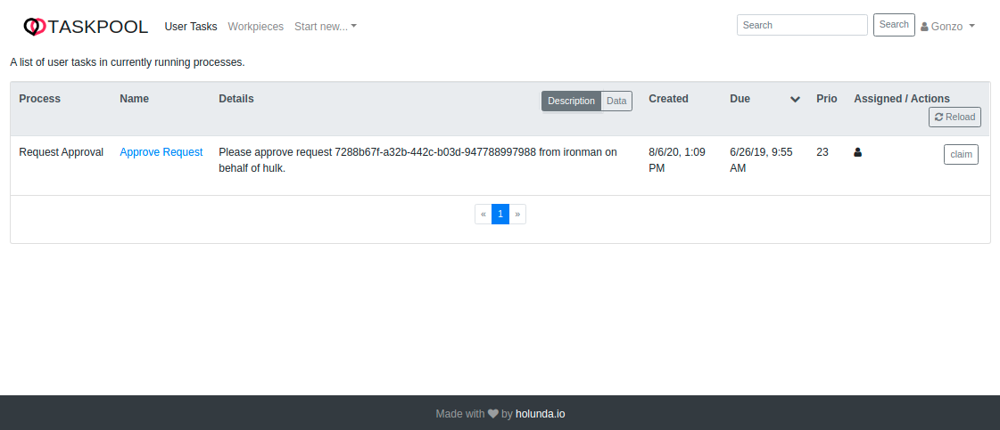
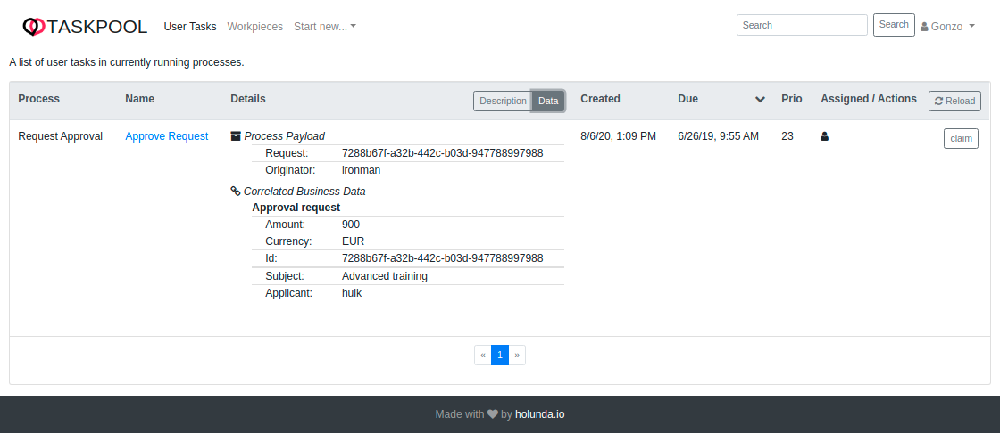
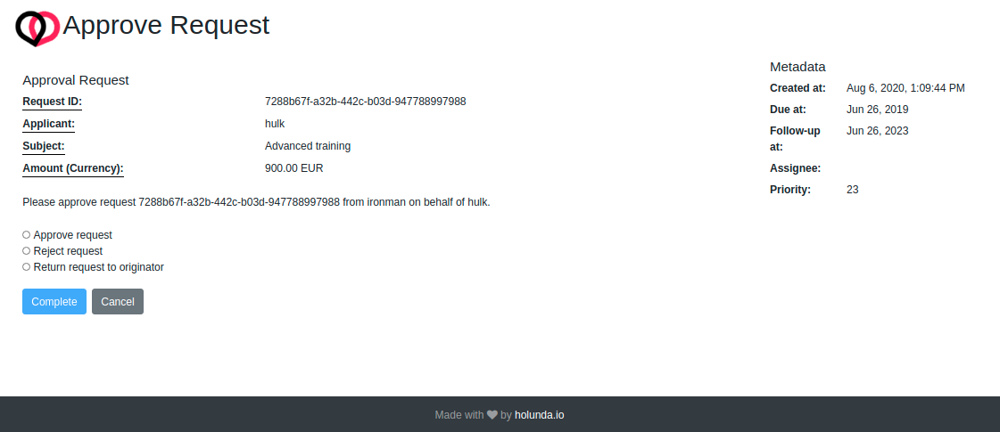
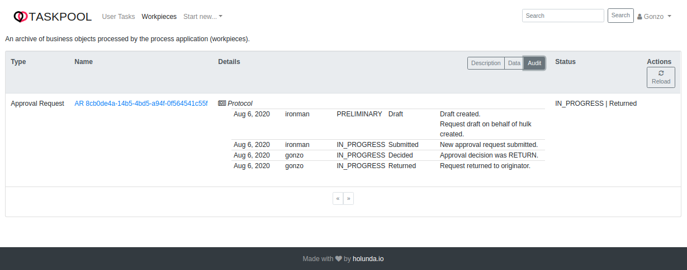
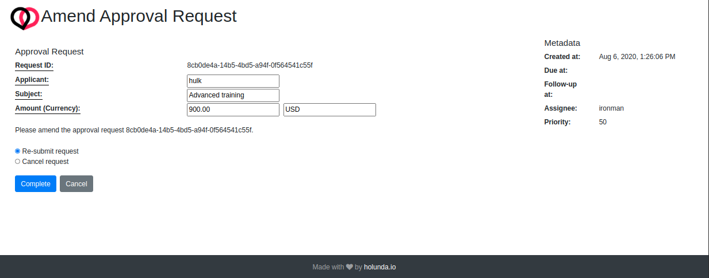

Alongside the library modules, several example modules and applications demonstrate the solution's main features.
This includes example applications for different [usage scenarios](./scenarios/). They all share the same
business process described in the next section.

## Business context: Approval

Consider the process model above. Imagine that you are building a system to manage all approval requests
in a company. Users can submit requests that are eventually approved or rejected. Sometimes, the __approver__
returns a request to the __originator__ for correction instead (the originator is the person who submitted it).
The __originator__ can then amend, resubmit, or cancel the request.

An approval request is modelled as follows. The __subject__ describes what the request is about, and the __applicant__ is the
person it concerns (who may differ from the __originator__). The __amount__ and __currency__ denote the request cost.
All requests must be stored for compliance purposes.

The request is initially created in the `DRAFT` state. It changes to `IN PROGRESS` when the process starts and eventually reaches
the final `ACCEPTED` or `REJECTED` state.

For this example, two user groups are created: The Muppet Show (`Kermit`, `Piggy`, `Gonzo`, and `Fozzy`) and The Avengers (`Ironman`,
`Hulk`). `Gonzo` and `Fozzy` are responsible for approvals.

## Process Run

The following sequence runs through the process model:

- `Ironman` submits an Advanced Training request on behalf of `Hulk`
- The request cost is provided in the wrong currency, so `Gonzo` returns the request to `Ironman` for correction (EUR instead of USD)
- `Ironman` changes the currency to USD and resubmits the request
- `Gonzo` is out of office, so `Fozzy` takes over and approves the request

## Running Examples

To run the example, see [Usage Scenarios](./scenarios/).

!!! note
    Because the process application includes the Camunda BPM engine, you can use the standard Camunda webapps at [http://localhost:8080/camunda/app/](http://localhost:8080/camunda/app/). The default credentials are `admin / admin`.

## Storyboard

The following storyboard explains the provided implementation:

TIP: This storyboard assumes that you started the single-node scenario and the application runs locally
at http://localhost:8080. Adjust the URLs if you started it differently.

- To start the approval process for a request, open the `Example Tasklist` in your browser:
[http://localhost:8080/polyflow/](http://localhost:8080/polyflow/). The selected user is `Ironman`.

- Open the `Start new...` menu and select `Request Approval`. You should see the start form for the example
approval process.

- Select `Advanced Training` from a predefined template and click _Start_. The start form disappears and redirects to
the empty `Tasklist`.

- Because you are still acting as `Ironman`, there is nothing to do here. Switch the user to `Gonzo`
in the top-right corner. You should see the `Approve Request` user task from the `Request Approval` process.

- Examine the task details by clicking the _Data_ tab in the _Details_ column. You can see the request data correlated with
the current process instance.

- Click the task name to open the `Approve Request` user-task form. Select
`Return request to originator` and click _Complete_.

- Switch to `Workpieces` to see the request business object. Examine the approval request by clicking
the _Data_, _Audit_, and _Description_ tabs in the _Details_ column.

- Change the user back to `Ironman`, switch to the `Tasklist`, and open the `Amend request` task. Change the currency to
`USD` and resubmit the request.

- Change the user back to `Fozzy`, open the `Approve Request` task, and approve the request by selecting the appropriate option.

- Switch to `Workpieces`; the request business object remains visible after the process finishes. Examine the approval
request by clicking the _Data_, _Audit_, and _Description_ tabs in the _Details_ column.
