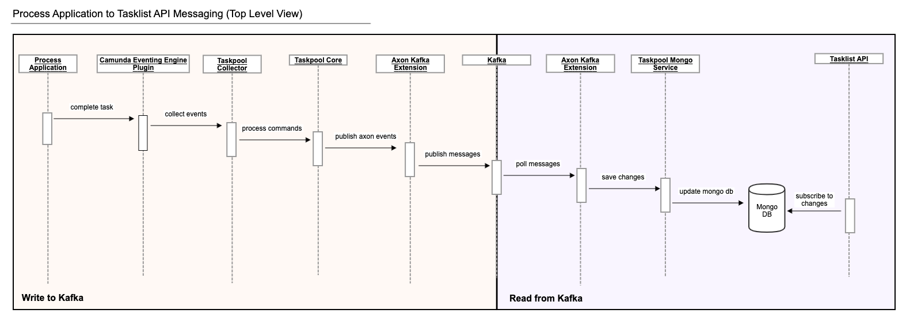
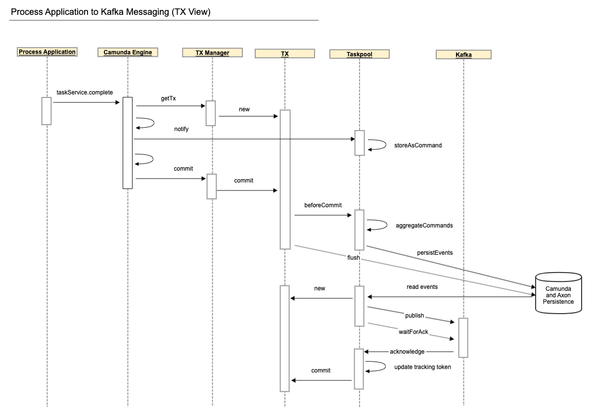
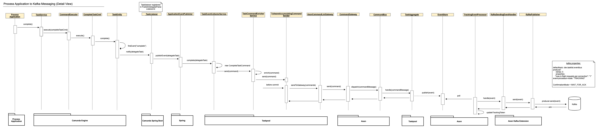
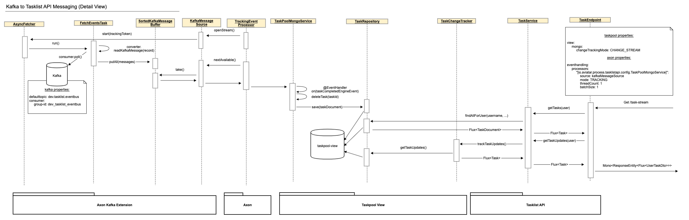

This document describes additional details to the distribution scenario without Axon Server. Especially, it is used by one of the adopters of Polyflow 
(runs in production by a customer) using Apache Kafka (technically Azure Event Hubs) as an event distribution technology. 

The following diagram depicts the task run from Process Application to the end user, consuming it via Tasklist API connected via Kafka and using Mongo DB for
persistence of the query model.



- The `Camunda BPM Taskpool Collector` component listens to Camunda events, collects all relevant events that happen in a single transaction and registers a
  transaction synchronization to process them `beforeCommit`. Just before the transaction is committed, the collected events are accumulated and sent as Axon
  Commands through the `CommandGateway`.
- The `Taskpool Core` processes those commands and issues Axon Events which are stored in Axon's database tables within the same transaction.
- The transaction commit finishes. If anything goes wrong before this point, the transaction rolls back, and it is as though nothing ever happened.
- In the `Axon Kafka Extension`, a `TrackingEventProcessor` polls for events and sees them as soon as the transaction that created them is committed. It sends
  each event to Kafka and waits for an acknowledgment from Kafka. If sending fails or times out, the event processor goes into error mode and retries until it
  succeeds. This can lead to events being published to Kafka more than once but guarantees at-least-once delivery.
- Within the Tasklist API, the `Axon Kafka Extension` polls the events from Kafka and another TrackingEventProcessor forwards them to the `TaskPoolMongoService`
  where they are processed to update the Mongo DB accordingly.
- When a user queries the Tasklist API for tasks, two things happen: Firstly, the Mongo DB is queried for the current state of tasks for this user and these
  tasks are returned. Secondly, the Tasklist API subscribes to any changes to the Mongo DB. These changes are filtered for relevance to the user and relevant
  changes are returned after the current state as an infinite stream until the request is cancelled or interrupted for some reason.



#### From Process Application to Kafka



#### From Kafka to Tasklist API



### Configure a Kafka view receiver

The view application consumes Axon events from Kafka with a
`StreamableKafkaMessageSource`. It needs an Axon Kafka consumer configuration,
one message source for each topic it consumes, and a tracking event processor
bound to each source. The example uses separate task and data-entry topics; a
view can add further sources for other event types.

Add Axon's Kafka Spring Boot starter to the view application:

```xml
<dependency>
  <groupId>org.axonframework.extensions.kafka</groupId>
  <artifactId>axon-kafka-spring-boot-starter</artifactId>
</dependency>
```

The shared Kafka configuration identifies the broker, configures the consumer,
and selects tracking processing:

```yaml
axon:
  serializer:
    events: jackson
    messages: jackson
    general: jackson
  axonserver:
    enabled: false
  kafka:
    # Required by the Axon Kafka extension even when explicit sources are used.
    defaulttopic: not_used_but_must_be_set_to_some_value
    client-id: taskpool-view
    consumer:
      bootstrap-servers: localhost:29092
      event-processor-mode: TRACKING
      auto-offset-reset: earliest
    properties:
      security.protocol: PLAINTEXT
```

For each Kafka topic, define a `ConsumerFactory` and a
`StreamableKafkaMessageSource` Spring bean. The source subscribes to the topic
and converts its records back into Axon event messages. This abbreviated
example is equivalent to the task and data-entry sources in the example
application:

```kotlin
@Bean
@Qualifier("polyflowTask")
fun kafkaConsumerFactoryPolyflowTask(
  properties: KafkaProperties
): ConsumerFactory<String, ByteArray> {
  properties.clientId = "polyflow-task-$hostname"
  return DefaultConsumerFactory(properties.buildConsumerProperties())
}

@Bean("kafkaMessageSourcePolyflowTask")
fun kafkaMessageSourcePolyflowTask(
  kafkaProperties: KafkaProperties,
  @Qualifier("polyflowTask") consumerFactory: ConsumerFactory<String, ByteArray>,
  kafkaFetcher: Fetcher<String, ByteArray, KafkaEventMessage>,
  @Qualifier("eventSerializer") serializer: Serializer,
  messageConverter: KafkaMessageConverter<String, ByteArray>
): StreamableKafkaMessageSource<String, ByteArray> =
  StreamableKafkaMessageSource
    .builder<String, ByteArray>()
    .topics(listOf("polyflow-task"))
    .consumerFactory(consumerFactory)
    .serializer(serializer)
    .fetcher(kafkaFetcher)
    .messageConverter(messageConverter)
    .bufferFactory {
      SortedKafkaMessageBuffer(kafkaProperties.fetcher.bufferSize)
    }
    .build()
```

The `source` in the following processor configuration is the Spring bean name,
not the Kafka topic name. The topic is selected by the source bean's `topics`
list. The qualifier only selects the `ConsumerFactory` to inject into that
bean.

```yaml
axon:
  eventhandling:
    processors:
      "[io.holunda.polyflow.view.jpa.service.task]":
        source: kafkaMessageSourcePolyflowTask
        mode: TRACKING
        threadCount: 1
        batchSize: 1
      "[io.holunda.polyflow.view.jpa.service.data]":
        source: kafkaMessageSourcePolyflowData
        mode: TRACKING
        threadCount: 1
        batchSize: 1
```

`StreamableKafkaMessageSource` is used with Axon tracking processors and does
not use Kafka consumer groups. Axon's tracking token records each view
processor's progress instead. Kafka delivery is at-least-once, so projections
must tolerate repeated events.

### Publishing startable process definitions

The example routes only the event payload types configured under
`polyflow.axon.kafka.topics`. To expose startable process definitions in the
separate view, add a route for
`ProcessDefinitionRegisteredEvent`, create the selected Kafka topic, and
configure the process-definition view processor to consume it. See
[Publishing Startable Process Definitions](../../reference-guide/components/startable-process-definitions.md#distributed-with-kafka)
for the producer mapping and view-processor configuration.

### System Requirements

* JDK 11
* Docker
* Docker Compose

### Preparations

Before you begin, please build the entire project with `mvn clean install` from the command line in the project root directory.

You will need some backing services (Kafka, PostgreSQL) and you can easily start them locally
by using the provided `docker-compose.yml` file.

Before you start change the directory to `examples/scenarios/distributed-kafka` and start required containers. The easiest way to do so is to run:

```bash
docker-compose up -d
```

### Start

The demo application consists of several Maven modules. In order to start the example, you will need to start only two
of them in the following order:

1. taskpool-application (process platform)
2. process-application (example process application)

The modules can be started by running from command line in the `examples/scenarios/distributed-kafka` directory using Maven or start the
packaged application using:


```bash
java -jar process-application-local-polyflow/target/*.jar
java -jar process-platform-view-only/target/*.jar
```

## Useful URLs

### Process Platform
* [http://localhost:8081/polyflow/tasks](http://localhost:8081/polyflow/tasks)
* [http://localhost:8081/polyflow/archive](http://localhost:8081/polyflow/archive)

### Process Application
* [http://localhost:8080/camunda/app/](http://localhost:8080/camunda/app/)
