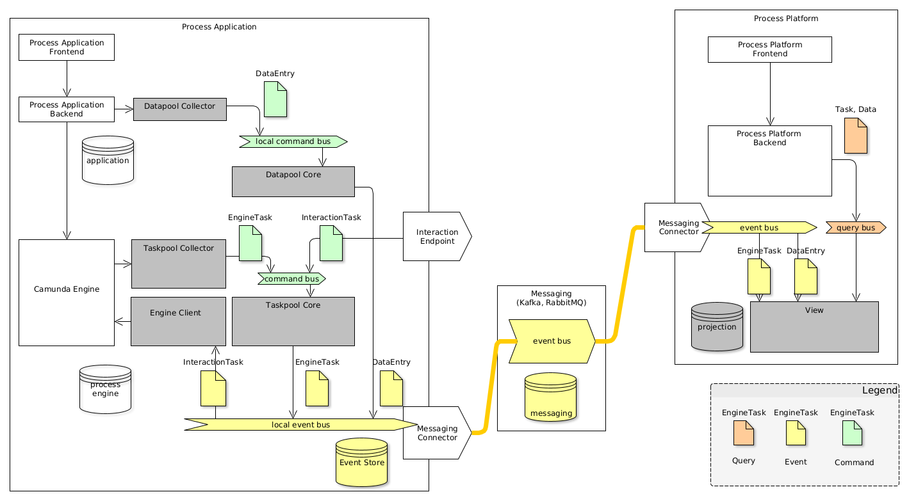

Several deployment scenarios of the components are possible depending on your requirements and available infrastructure.

The simplest setup is to run all components on a single node. A more advanced scenario is to distribute components over the network and connect them.

In doing so, one of the challenging issues for distribution and connecting microservices is a setup of messaging technology supporting required message exchange
patterns (MEPs) for a CQRS system. Because of different semantics of commands, events and queries and additional requirements of event-sourced persistence a
special implementation of command bus, event bus and event store is required. In particular, two scenarios can be distinguished: using Axon Server or using a
different distribution technology.

## Single node deployment

The easiest scenario is the **Single Node Deployment**. It provides all functional features of the Polyflow library, but is not addressing any of performance,
scalability, autonomy and reliability requirements. It works almost without additional infrastructure and is ideal to start with.

In a single node scenario the following configuration is used:

* All buses are local (command bus, event bus, query bus)
* Camunda BPM Integration components, Core components and View components are all deployed in the same node
* JPA-Based event storage is used, persisting the domain events in a RDBMS, along with Camunda-specific DB tables.
* Simple (In-memory) View or JPA view is used to provide query projections of `taskpool` and `datapool`

Check the following diagram for more details:

## Multiple node deployment

The more advanced scenario is to separate the **Process Platform components** from **Process Application components**, compare
the [concepts section](concepts.md). Especially, it is helpful if you intend to build a central **Process Platform** and multiple **Process applications** using
it.

In general, this is one of the main use cases for Polyflow framework itself, but the distribution aspects adds technical complexity to the resulting
architecture. Especially, following the architecture blueprint of Axon Framework, the three buses (Command bus, Event bus and Query bus) needs to be distributed
and act as connecting infrastructure between components.

### Distribution using Axon Server (core component as part of process platform)

Requirements:

- Event Store
- distributed command bus
- distributed event bus

Axon Server provides an implementation for this requirement leading to a distributed buses and a central Event Store. It is easy to use, easy to configure and
easy to run. If you need a HA setup, you will need the Enterprise license of Axon Server. Essentially, if you don't have another HA ready-to use messaging, this
scenario might be your way to go.

This scenario supports:

- central Process Platform components (core components and their projections)
- free choice for projection persistence (since Axon Server supports event replay)
- no direct synchronous communication between **Process Platform** and **Process Application** is required (e.g. via REST, since it is routed via command, event
  and query bus)
- central components should to be HA available 
- support routing of interaction task commands

The following diagram depicts the distribution of the components and the messaging:

### Distribution using Axon Server (core component as part of process engine)

Requirements:

- Event store
- distributed event bus

Axon Server provides an implementation for this requirement leading to a distributed buses and a central Event Store. It is easy to use, easy to configure and
easy to run. If you need a HA setup, you will need the Enterprise license of Axon Server. Essentially, if you don't have another HA ready-to use messaging, this
scenario might be your way to go.

This scenario supports:

- Core components deployed locally to the process engine (including task pool and data pool and their projections)
- free choice for projection persistence (since Axon Server supports event replay)
- direct communication between task list / engines required (addressing, routing)
- local core components for higher resilience (nothing can fail in local task and data entry processing)

The following diagram depicts the distribution of the components and the messaging:

### Distribution without Axon Server

If you already have another messaging at place, like Kafka or RabbitMQ, you might skip the usage of Axon Server. In doing so, you will be responsible for
distribution of events and will need to surrender some features.

This scenario supports:

- Core components deployed locally to the process engine (including task pool and data pool and their projections)
- view **MUST** be persistent (no replay supported)
- direct communication between task list / engines required (addressing, routing)
- local core components for higher resilience (nothing can fail in local task and data entry processing)

The following diagram depicts the distribution of the components and the messaging. See [Distributed using Kafka](../examples/scenarios/distributed-with-kafka.md)

