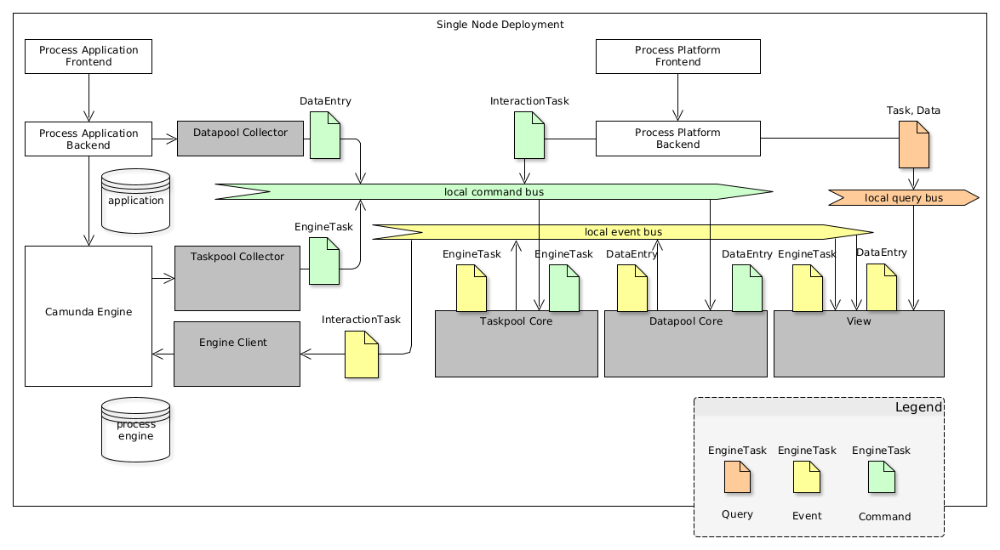
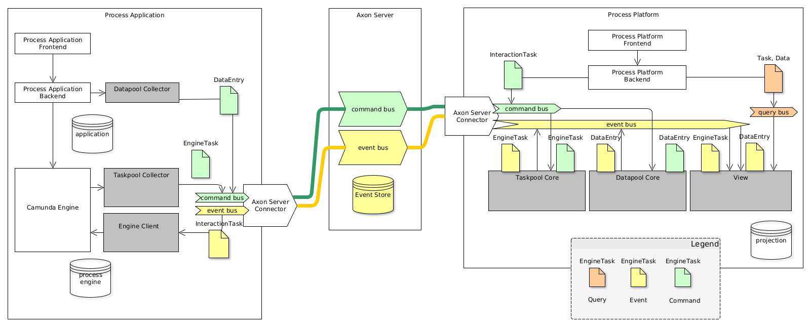
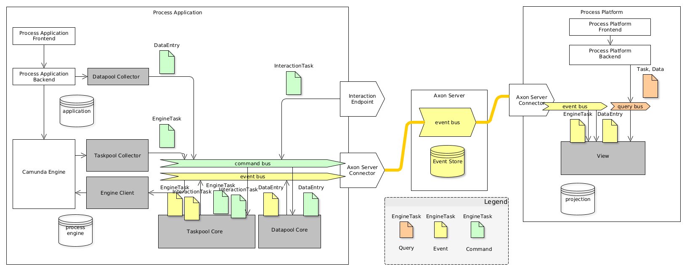
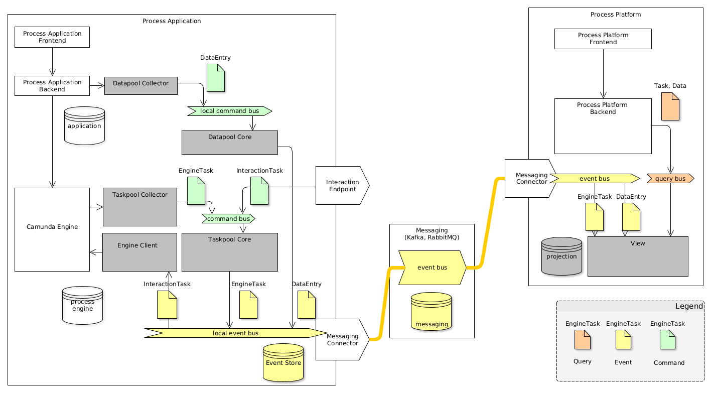

Several component deployment scenarios are possible, depending on your requirements and available infrastructure.

The simplest setup is to run all components on a single node. A more advanced scenario is to distribute components over the network and connect them.

For the corresponding Axon service responsibilities and runtime configuration,
see [Service Configuration](../reference-guide/configuration/service-configuration.md).

One challenge in distributing and connecting microservices is setting up messaging technology that supports the required message-exchange
patterns (MEPs) for a CQRS system. Because commands, events, and queries have different semantics, and event-sourced persistence has additional requirements,
the command bus, event bus, and event store need specialised implementations. In particular, two scenarios are possible: using Axon Server or another
distribution technology.

## Single node deployment

The simplest scenario is the **Single Node Deployment**. It provides all functional features of the Polyflow library but does not address performance,
scalability, autonomy, or reliability requirements. It requires almost no additional infrastructure and is ideal for getting started.

In a single node scenario the following configuration is used:

* All buses are local (command bus, event bus, query bus)
* Camunda BPM integration, Core, and View components are all deployed on the same node.
* JPA-based event storage persists domain events in an RDBMS alongside Camunda-specific database tables.
* A Simple (in-memory) View or JPA View provides query projections for `taskpool` and `datapool`.

Check the following diagram for more details:

## Multiple node deployment

The more advanced scenario separates **Process Platform components** from **Process Application components**; see
the [concepts section](concepts.md). It is particularly useful when you want to build a central **Process Platform** used by multiple **Process Applications**.

This is one of the main use cases for the Polyflow framework, but distribution adds technical complexity to the resulting
architecture. Following the Axon Framework architecture blueprint, the three buses (command, event, and query) must be distributed
and act as the connecting infrastructure between components.

### Distribution using Axon Server (core component as part of process platform)

Requirements:

- Event Store
- distributed command bus
- distributed event bus

Axon Server provides the required distributed buses and a central Event Store. It is straightforward to use, configure, and run. A high-availability setup
requires an Axon Server Enterprise license. This scenario may be a good fit if you do not already have high-availability messaging infrastructure.

This scenario supports:

- central Process Platform components (core components and their projections)
- free choice for projection persistence (since Axon Server supports event replay)
- no direct synchronous communication between **Process Platform** and **Process Application** is required (e.g. via REST, since it is routed via command, event
  and query bus)
- central components should be highly available
- support routing of interaction task commands

The following diagram depicts the distribution of the components and the messaging:

### Distribution using Axon Server (core component as part of process engine)

Requirements:

- Event store
- distributed event bus

Axon Server provides the required distributed buses and a central Event Store. It is straightforward to use, configure, and run. A high-availability setup
requires an Axon Server Enterprise license. This scenario may be a good fit if you do not already have high-availability messaging infrastructure.

This scenario supports:

- Core components deployed locally to the process engine (including task pool and data pool and their projections)
- free choice for projection persistence (since Axon Server supports event replay)
- direct communication between task list / engines required (addressing, routing)
- local core components for higher resilience (nothing can fail in local task and data entry processing)

The following diagram depicts the distribution of the components and the messaging:

### Distribution without Axon Server

If you already have another messaging system, such as Kafka or RabbitMQ, you may not need Axon Server. In that case, you are responsible for
distributing events and must forgo some features.

This scenario supports:

- Core components deployed locally to the process engine (including task pool and data pool and their projections)
- view **MUST** be persistent (no replay supported)
- direct communication between task list / engines required (addressing, routing)
- local core components for higher resilience (nothing can fail in local task and data entry processing)

The following diagram depicts the distribution of the components and the messaging. See [Distributed using Kafka](../examples/scenarios/distributed-with-kafka.md)

