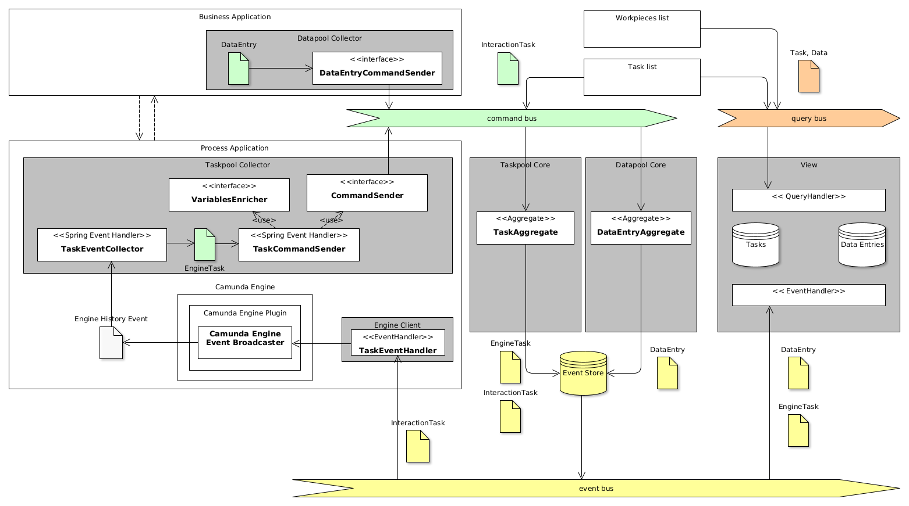

## General Idea

The implementation of a single (small) process application can be easily done using the process engine library itself (for example like Camunda BPM). If the
solution becomes larger, for example by setting up multiple engines for different processes or if the load on a single process engine becomes unmanageable, it
is worth to separate the solution into **process specific** and **process agnostic** parts. We call the process specific part of the solution **Process
Application** and the process agnostic part **Process Platform**, as described in the [concept section](concepts.md).

Based on the assumption of the asymmetric read/write characteristics of task-oriented process applications, we decided to apply the Command Query Responsibility
Segregation (CQRS) pattern for the architectural design. As a result, we supply components to collect the information from the process engines and create a
read-optimized projections with user tasks and correlated business data. The components can be easily integrated into process applications and be used as
foundation to build parts of the process platform.

## Design Decisions

We decided to build the library as a collection of loosely-coupled components which can be used during the construction of the process automation solution in
different ways, depending on your [Usage Scenario](../examples/scenarios).

The process platform is a central application consisting of business process independent components like a central user management, task inbox (aka task list),
a business object view, audit logs and others. One or many process applications integrate with the process platform by implementing individual business
processes and provide user tasks and business data changes to it. They may also ship application frontends, which are integrated into/with the frontends of the
process platform, including business object views, user task forms and other required pieces.

The following diagram depicts the overall logical architecture:

## Implementation Decisions

The components are implemented using Kotlin programming language and rely on SpringBoot as execution environment. They make a massive use of Axon Framework as a
basis of the CQRS implementation. In addition, we rely on event sourcing (ES) as persistence implementation. Due to the usage of the Axon Framework, you can
choose the Event Store implementation, based on the available technology. Available options for the Event Store are Axon Server, JDBC, JPA or Mongo.

The read-optimized projections use an internal API for constructing query models. Several query models are available: In-memory, Mongo and JPA are choices
matching different requirements of the scenarios of process applications and process platform. All query models implement the same public API allowing an easy
exchange of the implementation depending on available technology or changing requirements.

Several integration components are available for collecting information from process engines and other third-party applications. Along with generic collectors
for integrations of custom components, a specialized integration component for Camunda BPM engine is provided. It seamlessly integrates with the Camunda BPM
engine using Camunda Engine's Plug-in mechanism and automatically delivers process definitions, process instances, process variables from the process engine. In
addition, it allows enrichment of user tasks with custom process data. By doing so, the Camunda Integration component allows to include more information into
user tasks and allows the task read projections to outperform the Camunda Task Service, providing more features and higher performance.

The following figure demonstrates the architecture of the Camunda Integration component.

The loosely-coupled nature of the Polyflow framework supports different deployment strategies. It can be used in the context of a single process engine as well
as in the context of a process landscape with multiple engines. In doing so, the Polyflow components can be used in a central system for collection, storage and
provisioning of the user tasks and business data for the entire process landscape. The usage of the generic integration components allows for integration of
heterogeneous process engines and other task and business data systems. For more details, please check the documentation on [Deployment Scenarios](deployment.md). 
