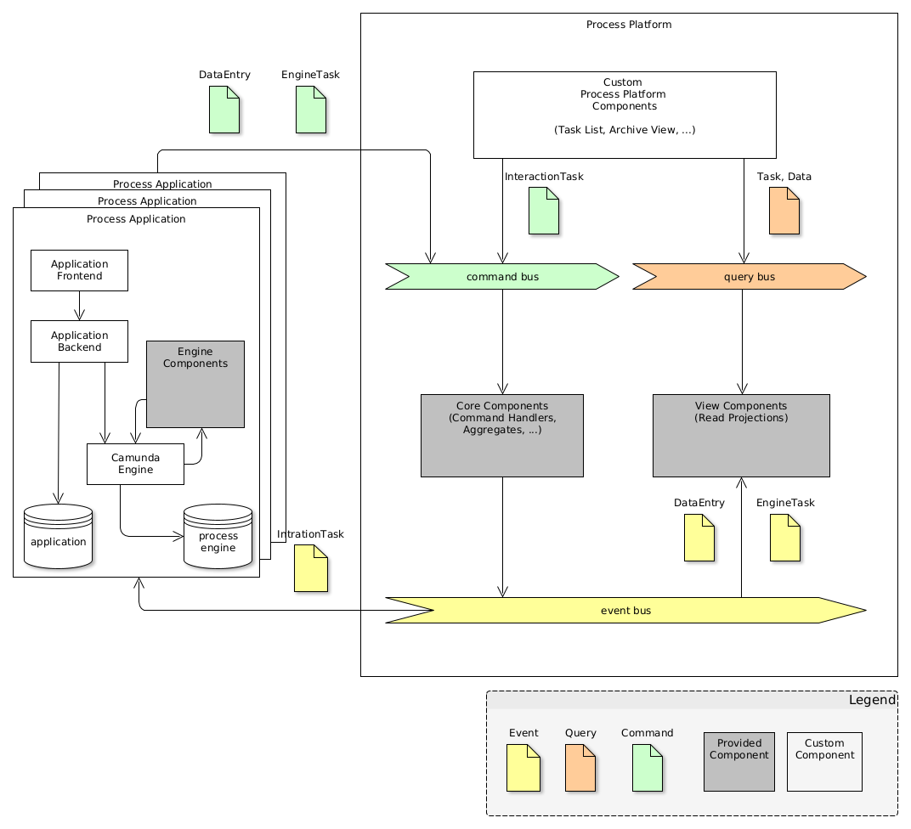
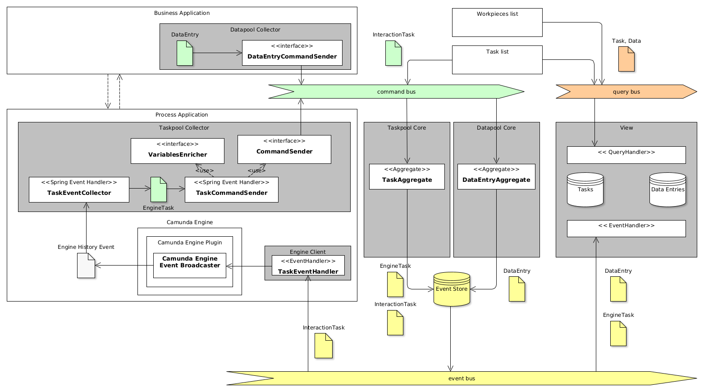

## General Idea

A single, small process application can be implemented directly with a process-engine library such as Camunda BPM. If the
solution grows—for example, by adding engines for different processes or by placing too much load on one engine—it is
worth separating it into **process-specific** and **process-agnostic** parts. We call the process-specific part **Process
Application** and the process-agnostic part **Process Platform**, as described in the [concepts section](concepts.md).

Based on the assumption of the asymmetric read/write characteristics of task-oriented process applications, we decided to apply the Command Query Responsibility
Segregation (CQRS) pattern for the architectural design. As a result, we supply components that collect information from process engines and create
read-optimised projections containing user tasks and correlated business data. The components can be integrated into process applications and used as a
foundation for process-platform features.

## Design Decisions

We designed the library as a collection of loosely coupled components that can be combined in
different ways, depending on your [usage scenario](../examples/scenarios).

The process platform is a central application comprising business-process-independent components such as central user management, a task inbox (task list),
a business-object view, and audit logs. One or more process applications integrate with the platform by implementing individual business
processes and providing user tasks and business-data changes. They may also provide application frontends that integrate with the process-platform frontend,
including business-object views, user task forms, and other required elements.

The following diagram depicts the overall logical architecture:

## Implementation Decisions

The components are implemented in Kotlin and rely on Spring Boot as their runtime environment. They use Axon Framework as the
basis for CQRS. They also use event sourcing (ES) for persistence. With Axon Framework, you can
choose an Event Store implementation based on the available technology: Axon Server, JDBC, JPA, or Mongo.

The read-optimised projections use an internal API for constructing query models. Several query models are available: in-memory, Mongo, and JPA,
each suited to different process-application and process-platform requirements. All query models implement the same public API, allowing the
implementation to be exchanged as available technology or requirements change.

Several integration components collect information from process engines and other third-party applications. Alongside generic collectors
for custom-component integration, Polyflow provides a specialised integration component for the Camunda BPM engine. It integrates with the Camunda BPM
engine through Camunda Engine's plug-in mechanism and automatically delivers process definitions, process instances, and process variables. It also
enriches user tasks with custom process data. This allows task read projections to include more information than Camunda Task Service and deliver more features and higher performance.

The following figure demonstrates the architecture of the Camunda Integration component.

The loosely coupled nature of the Polyflow framework supports different deployment strategies. It can be used with a single process engine or
across a process landscape with multiple engines. Polyflow components can run in a central system that collects, stores, and
provides user tasks and business data for the entire process landscape. Generic integration components also support
heterogeneous process engines and other task and business-data systems. For details, see [Deployment Scenarios](deployment.md).
