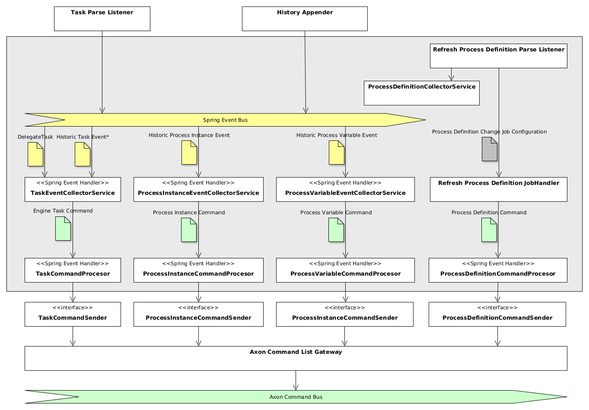

### Purpose

Taskpool Collector is deployed as part of a process application
(alongside the Camunda BPM engine) and collects information from
the engine. It detects the _intent_ of operations executed inside the engine
and creates the corresponding Taskpool commands. The commands are enriched with data and sent to
other Taskpool components through the command bus.

This description uses the terms _event_ and _command_. An event is an entity
received from the Camunda BPM engine through a delegate or history event listener,
then passed to Taskpool Collector through the internal **Spring eventing** mechanism. Taskpool
Collector converts these events into a Taskpool command—an entity that represents an intended
change in Taskpool Core. Note that _event_ has a different meaning in CQRS/ES systems
and other Taskpool components; in the Taskpool Collector context, an event always originates from
Spring eventing.

### Features

- Collection of process definitions
- Collection of process instance events
- Collection of process variable change events
- Collection of task events and history events
- Creation of task engine commands
- Collection of task-assignment information
- Enrichment of task engine commands with process variables
- Attachment of correlation information to task engine commands
- Transmission of commands to Axon command bus
- Provision of properties for a process application

### Architecture



Taskpool Collector consists of several components, divided into the following groups:

- Event collector services gather information and form commands.
- Processors manipulate commands, for example by enriching them with payload and data correlations.
- Command senders are part of the `command-sender` component. They accumulate commands and send them to Axon Command List Gateway.

### Usage and configuration

To enable the collector component, add the Maven dependency to your process application:

```xml

<dependency>
  <groupId>io.holunda.polyflow<groupId>
  <artifactId>polyflow-camunda-bpm-taskpool-collector</artifactId>
  <version>${camunda-taskpool.version}</version>
<dependency>

```

Then activate Taskpool Collector by adding the annotation to a Spring configuration class:

```java
@Configuration
@Import(CamundaTaskpoolCollectorConfiguration.class)
class MyProcessApplicationConfiguration {

}

```

### Event collection

By default, Taskpool Collector registers Spring Event Listener to the following events, fired by Camunda Eventing Engine Plugin:

* `DelegateTask` events:
  ** create
  ** update 
  ** delete
  ** complete
* `HistoryEvent` events:
  ** HistoricTaskInstanceEvent
  ** HistoricIdentityLinkLogEvent
  ** HistoricProcessInstanceEventEntity
  ** HistoricVariableUpdateEventEntity
  ** HistoricDetailVariableInstanceUpdateEntity

The events are transformed into corresponding commands and passed to the processor layer. Until Camunda Platform 7.19, eventing
is triggered only through custom listeners. Polyflow components do not rely on these; instead, they use their own implementation of built-in, non-skippable listeners.
Therefore, disable Camunda Platform custom listeners by setting `camunda.bpm.eventing.task` to `false`.

During collection of task information, you can control which listeners are registered. By default, all listeners are considered but you can change
this behaviour by setting two properties:

```yaml

polyflow:
  integration:
    collector:
      camunda:
        task:
          excluded-task-event-names: assignment, delete
          excluded-history-event-names: add-identity-link, delete-identity-link
```
This setting is useful when you want to disable engine assignment entirely and provide your own task-assignment algorithm or
use assignment based on process variables (see below).

### Task commands enrichment

Alongside the attributes received from the Camunda BPM engine, engine task commands
can be enriched with additional attributes.

There are three enrichment modes available controlled by the `polyflow.integration.collector.camunda.task.enricher.type` property:

* `no`: No enrichment takes place
* `process-variables`: Enrichment of engine task commands with process variables
* `custom`: User provides own implementation

#### Process variable enrichment

In particular cases, the data enclosed into task attributes is not sufficient for the task list or other user-related components. The information may be
available as process variables and must be attached to the task in the task pool. Use _Process Variable Task Enricher_ for this purpose.
Activate it by setting `polyflow.integration.collector.camunda.task.enricher.type` to `process-variables`; the enricher then
put process variables into the task payload.

You can control what variables will be put into task command payload by providing the Process Variables Filter.
The `ProcessVariablesFilter` is a Spring bean holding individual `VariableFilter` instances. Process-specific filters
are combined; filters without a process definition key are global and apply when no process-specific filter exists. If
the filter is not provided, a default empty `EXCLUDE` filter is used, resulting in all process variables being attached
to the user task.

Alternatively, enable the property-backed filter. A filter with `process-variables` is process-level; a filter with
`task-variables` is task-level and therefore requires `process-definition-key`. Both can be configured together for a
process; task-level rules further restrict the process-level rule. See
[Remote Engine Process-Variable Configuration](../configuration/remote-engine-process-variable-configuration.md) for
the complete property reference and remote-engine examples.

```yaml
polyflow:
  integration:
    collector:
      camunda:
        task:
          enricher:
            process-variables-filter:
              enabled: true
              filters:
                - process-definition-key: approval
                  filter-type: INCLUDE
                  process-variables: [requestId, applicant]
                  task-variables:
                    approve: [requestId, applicant]
```

A global process-variable filter can be configured by omitting `process-definition-key`. It applies to processes
without a dedicated filter; a process-specific filter takes precedence. For example, this excludes the technical
`internalAudit` variable from every process that is not configured explicitly:

```yaml
polyflow:
  integration:
    collector:
      camunda:
        task:
          enricher:
            process-variables-filter:
              enabled: true
              filters:
                - filter-type: EXCLUDE
                  process-variables: [internalAudit]
                - process-definition-key: approval
                  filter-type: INCLUDE
                  process-variables: [requestId, applicant]
```

A `VariableFilter` can be of the following type:

* `TaskVariableFilter`:
  ** `INCLUDE`: task-level include filter, denoting a list of variables to be added for the task defined in the filter.
  ** `EXCLUDE`: task-level exclude filter, denoting a list of variables to be ignored for the task defined in the filter. All other variables are included.
* `ProcessVariableFilter` with process definition key:
  ** `INCLUDE`: process-level include filter, denoting a list of variables to be added for all tasks of the process.
  ** `EXCLUDE`: process-level exclude filter, denoting a list of variables to be ignored for all tasks of the process.
* `ProcessVariableFilter` _without_ process definition key:
  ** `INCLUDE`: global include filter, denoting a list of variables to be added for all tasks of all processes for which no dedicated `ProcessVariableFilter` is
  defined.
  ** `EXCLUDE`: global exclude filter, denoting a list of variables to be ignored for all tasks of all processes for which no dedicated `ProcessVariableFilter`
  is defined.

Here is an example, how the process variable filter can configure the enrichment:

```java
@Configuration
public class MyTaskCollectorConfiguration {

  @Bean
  public ProcessVariablesFilter myProcessVariablesFilter() {

    return new ProcessVariablesFilter(
      // define a variable filter for every process
      new VariableFilter[]{
        // define for every process definition
        // either a TaskVariableFilter or ProcessVariableFilter
        new TaskVariableFilter(
          ProcessApproveRequest.KEY,
          // filter type
          FilterType.INCLUDE,
          ImmutableMap.<String, List<String>>builder()
                      // define a variable filter for every task of the process
                      .put(ProcessApproveRequest.Elements.APPROVE_REQUEST, Lists.newArrayList(
                        ProcessApproveRequest.Variables.REQUEST_ID,
                        ProcessApproveRequest.Variables.ORIGINATOR)
                      )
                      // and again
                      .put(ProcessApproveRequest.Elements.AMEND_REQUEST, Lists.newArrayList(
                        ProcessApproveRequest.Variables.REQUEST_ID,
                        ProcessApproveRequest.Variables.COMMENT,
                        ProcessApproveRequest.Variables.APPLICANT)
                      ).build()
        ),
        // optionally add a global filter for all processes
        // for that no individual filter was created
        new ProcessVariableFilter(FilterType.INCLUDE,
                                  Lists.newArrayList(CommonProcessVariables.CUSTOMER_ID))
      }
    );
  }
}
```

!!! note  
      If you want to implement a custom enrichment, please provide your own implementation of the interface `VariablesEnricher`
      (register a Spring Component of the type) and set the property `polyflow.integration.collector.camunda.task.enricher.type` to `custom`.

!!! warning
      Avoid using a classic Camunda `TaskListener` which modifies process variables on task creation, since changes of those
      listeners can't be used during task enrichment. A proper way to modify instance or task variables is to implement an ordered Spring
      `EventListener` listening on `DelegateTask`, put it before the enricher by providing `@Order(TaskEventCollectorService.ORDER - 80)` and scope the event listener to 
      the task of your interest using condition: `@EventListener(condition = "#delegateTask.taskDefinitionKey.equals('my-task-key') && #delegateTask.eventName.equals('create')")` 

### Data Correlation

Apart from task payload attached by the enricher, the so-called _Correlation_ with data entries can
be configured. Data correlation attaches one or more references (a pair of `entry-type` and `entryId` values) to a
business data entry and task. In the projection used for task queries, these correlations are resolved and
information from business data events can be shown alongside task information.

Configure data-event correlation by providing a `ProcessVariablesCorrelator` bean. For example:

```kotlin
@Bean
fun process-variablesCorrelator() = ProcessVariablesCorrelator(
    // define correlation for every process
    ProcessVariableCorrelation(
      ProcessApproveRequest.KEY,
      mapOf(
        // define a correlation for every task needed
        ProcessApproveRequest.Elements.APPROVE_REQUEST to mapOf(
          ProcessApproveRequest.Variables.REQUEST_ID to BusinessDataEntry.REQUEST
        )
      ),
      // define a correlation globally (for the whole process)
      mapOf(ProcessApproveRequest.Variables.REQUEST_ID to BusinessDataEntry.REQUEST)
    )
  )
```

It can also be supplied from Spring properties. Enabling this configuration creates the correlator in place of the
empty fallback bean. See [Remote Engine Process-Variable Configuration](../configuration/remote-engine-process-variable-configuration.md)
for the complete property reference and remote-engine examples.

```yaml
polyflow:
  integration:
    collector:
      camunda:
        task:
          enricher:
            process-variables-correlator:
              enabled: true
              correlations:
                - process-definition-key: approval
                  global-correlations:
                    - entry-id-variable-name: requestId
                      entry-type: request
                  correlations:
                    approve:
                      - entry-id-variable-name: customerId
                        entry-type: customer
```

The process-variable correlator holds a list of process-variable correlations, one for each process
definition key. Each `ProcessVariableCorrelation` configures correlations for all tasks or for an individual task through a correlation
map. A correlation map is keyed by a Camunda process-engine variable name and contains the business-data entry type as its value.

Here is an example. Imagine the process instance is storing the id of an approval request in a process variable called
`varRequestId`. The system that stores approval requests fires data-entry events containing the
data, with `io.my.approvalRequest` as the entry type and the request ID as `entryId`. To
create a correlation for task `task_approve_request` of `process_approval_process`, configure the correlator as follows:

```kotlin
@Bean
fun processVariablesCorrelator() = ProcessVariablesCorrelator(

    ProcessVariableCorrelation(
      "process_approval_process",
      mapOf(
        "task_approve_request" to mapOf(
          // process variable 'varRequestId' holds the id of a data entry of type 'io.my.approvalRequest'
          "varRequestId" to "io.my.approvalRequest"
        )
      )
    )
  )
```

If the process instance now contains the approval request id `"4711"` in the process variable `varRequestId`
and the process reaches task `task_approve_request`, the following correlation is created
(shown here as JSON):

```json
"correlations": [
  { "entry-type": "approvalRequest", "entryId": "4711" }
]
```

### Message codes

> Please note that the logger root hierarchy is `io.holunda.polyflow.taskpool.collector`

| Message Code     | Severity | Logger*               | Description                                                                                                                 | Meaning  |
|------------------|----------|:----------------------|:----------------------------------------------------------------------------------------------------------------------------|:---------| 
| `COLLECTOR-001`  | `INFO`   |                       | Task commands will be collected.                                                                                            |          |
| `COLLECTOR-002`  | `INFO`   |                       | Task commands will not be collected.                                                                                         |          |
| `COLLECTOR-005`  | `TRACE`  | `.process.definition` | Sending process definition command: $command                                                                                |          |
| `COLLECTOR-006`  | `TRACE`  | `.process.instance`   | Sending process instance command: $command                                                                                  |          |
| `COLLECTOR-007`  | `TRACE`  | `.process.variable`   | Sending process variable command: $command                                                                                  |          |
| `COLLECTOR-008`  | `TRACE`  | `.task`               | Sending engine task command: $command.                                                                                      |          |
| `ENRICHER-001`   | `INFO`   |                       | Task commands will be enriched with process variables.                                                                      |          |
| `ENRICHER-002`   | `INFO`   |                       | Task commands will not be enriched.                                                                                         |          |
| `ENRICHER-003`   | `INFO`   |                       | Task commands will be enriched by a custom enricher.                                                                        |          |
| `ENRICHER-004`   | `DEBUG`  | `.task.enricher`      | Could not enrich variables from running execution ${command.sourceReference.executionId}, since it doesn't exist (anymore). |          |

### Task Assignment

User task assignment is a core functionality for every process application fostering task-oriented work. By default, Taskpool Collector uses
information from Camunda User Task and maps that one-to-one to properties of the user task commands. The task attribute
`assignee`, `candidate-users`, and `candidate-groups` are mapped to the corresponding attributes automatically.

To control the task-assignment mode, configure Taskpool Collector through application properties. The property
`polyflow.integration.collector.camunda.task.assigner.type` has the following values:

* `no`: No additional assignment takes place, the Camunda task attributes are used (default)
* `process-variables`: Use process variables for assignment information, see below
* `custom`: Provide your own `TaskAssigner` implementation as a bean.

If the value is set to `process-variables`, you can set up a constant mapping defining the process variables carrying the assignment
information. The corresponding properties are:

```yaml
polyflow:
  integration:
    collector:
      camunda:
        task:
          assigner:
            type: process-variables
            assignee: my-assignee-var
            candidate-users: my-candidate-users-var
            candidate-groups: my-candidate-group-var
```

### Task Importer

Alongside the event-based Task Collector based on Camunda Eventing, a dedicated service can query the Camunda database for existing
user tasks and publish the results. To avoid duplicate tasks, collected tasks are filtered. You can choose
the supplied `eventstore` filter or provide a `custom` filter by implementing `EngineTaskCommandFilter` as
a Spring bean. To use this task-import facility, activate it in the application configuration.

The following property block is used for configuration:

```yaml
polyflow:
  integration:
    collector:
      camunda:
        task:
          importer:
            enabled: true
            task-filter-type: eventstore
```

This makes `TaskServiceCollectorService` available to trigger the import. The `eventstore` filter is useful when
[Taskpool Core](./core-taskpool) is deployed alongside Taskpool Collector as part of the process application or process engine.
