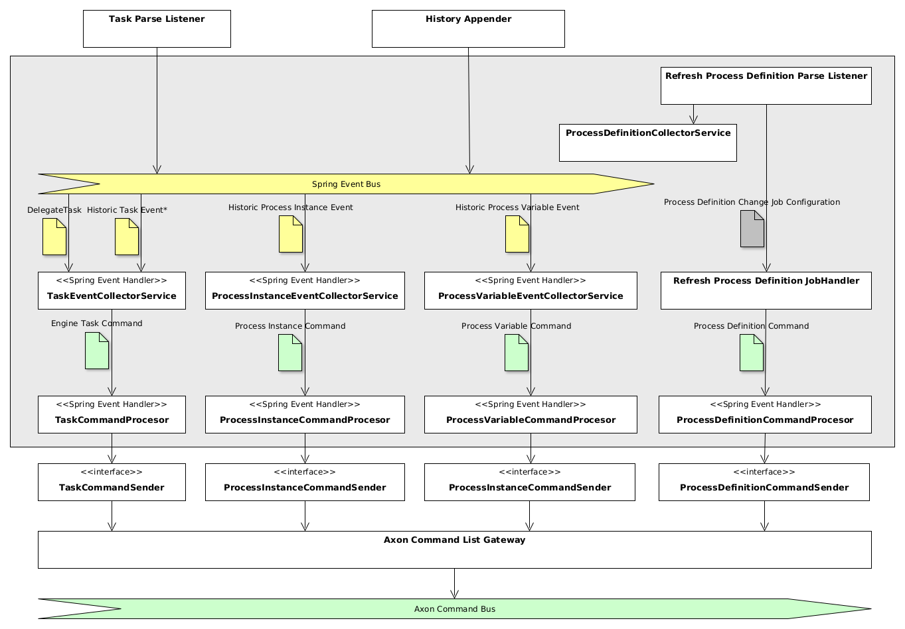

### Purpose

Taskpool Collector is a component deployed as a part of the process application
(aside with Camunda BPM Engine) that is responsible for collecting information from
the Camunda BPM Engine. It detects the _intent_ of the operations executed inside the engine
and creates the corresponding commands for the Taskpool. The commands are enriched with data and transmitted to
other taskpool components (via Command Bus).

In the following description, we use the terms _event_ and _command_. Event denotes an entity
received from Camunda BPM Engine (from delegate event listener or from history event listener)
which is passed over to the Taskpool Collector using internal **Spring eventing** mechanism. The Taskpool
Collector converts the series of such events into a Taskpool Command - an entity carrying an intent
of change inside the Taskpool core. Please note that _event_ has another meaning in CQRS/ES systems
and other components of the Taskpool, but in the context of Taskpool collector an event always originates from
Spring eventing.

### Features

- Collection of process definitions
- Collection of process instance events
- Collection of process variable change events
- Collection of task events and history events
- Creation of task engine commands
- Enrichment of task engine commands with process variables
- Attachment of correlation information to task engine commands
- Transmission of commands to Axon command bus
- Provision of properties for process application

### Architecture



The Taskpool Collector consists of several components which can be divided into the following groups:

- Event collectors receive are responsible for gathering information and form commands
- Processor performs the command enrichment with payload and data correlation
- Command senders are responsible for accumulating commands and sending them to Command Gateway

### Usage and configuration

In order to enable collector component, include the Maven dependency to your process application:

```xml

<dependency>
  <groupId>io.holunda.polyflow
    <groupId>
      <artifactId>polyflow-camunda-bpm-taskpool-collector</artifactId>
      <version>${camunda-taskpool.version}</version>
      <dependency>

```

Then activate the taskpool collector by providing the annotation on any Spring Configuration:

```java
@Configuration
@Import(CamundaTaskpoolCollectorConfiguration.class)
class MyProcessApplicationConfiguration {

}

```

### Event collection

Taskpool Collector registers Spring Event Listener to the following events, fired by Camunda Eventing Engine Plugin:

* `DelegateTask` events:
  ** create
  ** assign
  ** delete
  ** complete
* `HistoryEvent` events:
  ** HistoricTaskInstanceEvent
  ** HistoricIdentityLinkLogEvent
  ** HistoricProcessInstanceEventEntity
  ** HistoricVariableUpdateEventEntity
  ** HistoricDetailVariableInstanceUpdateEntity

The events are transformed into corresponding commands and passed over to the processor layer.

### Task commands enrichment

Alongside with attributes received from the Camunda BPM engine, the engine task commands
can be enriched with additional attributes.

There are three enrichment modes available controlled by the `polyflow.integration.collector.camunda.task.enricher.type` property:

* `no`: No enrichment takes place
* `process-variables`: Enrichment of engine task commands with process variables
* `custom`: User provides own implementation

#### Process variable enrichment

In particular cases, the data enclosed into task attributes is not sufficient for the task list or other user-related components. The information may be
available as process variables and need to be attached to the task in the taskpool. This is where _Process Variable Task Enricher_ can be used. For this
purpose, active it, setting the property `polyflow.integration.collector.camunda.task.enricher.type` to `process-variables` and the enricher will
put process variables into the task payload.

You can control what variables will be put into task command payload by providing the Process Variables Filter.
The `ProcessVariablesFilter` is a Spring bean holding a list of individual `VariableFilter` - at most one per
process definition key and optionally one without process definition key (a global filter). If the filter is not provded,
a default filter is used which is an empty `EXCLUDE` filter, resulting in all process variables being attached to the user task.

A `VariableFilter` can be of the following type:

* `TaskVariableFilter`:
  ** `INCLUDE`: task-level include filter, denoting a list of variables to be added for the task defined in the filter.
  ** `EXCLUDE`: task-level exclude filter, denoting a list of variables to be ignored for the task defined in the filter. All other variables are included.
* `ProcessVariableFilter` with process definition key:
  ** `INCLUDE`: process-level include filter, denoting a list of variables to be added for all tasks of the process.
  ** `EXCLUDE`: process-level exclude filter, denoting a list of variables to be ignored for all tasks of the process.
* `ProcessVariableFilter` _without_ process definition key:
  ** `INCLUDE`: global include filter, denoting a list of variables to be added for all tasks of all processes for which no dedicated `ProcessVariableFilter` is
  defined.
  ** `EXCLUDE`: global exclude filter, denoting a list of variables to be ignored for all tasks of all processes for which no dedicated `ProcessVariableFilter`
  is defined.

Here is an example, how the process variable filter can configure the enrichment:

```java
  @Configuration
public class MyTaskCollectorConfiguration {

  @Bean
  public ProcessVariablesFilter myProcessVariablesFilter() {

    return new ProcessVariablesFilter(
      // define a variable filter for every process
      new VariableFilter[]{
        // define for every process definition
        // either a TaskVariableFilter or ProcessVariableFilter
        new TaskVariableFilter(
          ProcessApproveRequest.KEY,
          // filter type
          FilterType.INCLUDE,
          ImmutableMap.<String, List<String>>builder()
                      // define a variable filter for every task of the process
                      .put(ProcessApproveRequest.Elements.APPROVE_REQUEST, Lists.newArrayList(
                        ProcessApproveRequest.Variables.REQUEST_ID,
                        ProcessApproveRequest.Variables.ORIGINATOR)
                      )
                      // and again
                      .put(ProcessApproveRequest.Elements.AMEND_REQUEST, Lists.newArrayList(
                        ProcessApproveRequest.Variables.REQUEST_ID,
                        ProcessApproveRequest.Variables.COMMENT,
                        ProcessApproveRequest.Variables.APPLICANT)
                      ).build()
        ),
        // optionally add a global filter for all processes
        // for that no individual filter was created
        new ProcessVariableFilter(FilterType.INCLUDE,
                                  Lists.newArrayList(CommonProcessVariables.CUSTOMER_ID))
      }
    );
  }
}
```

!!! note  
      If you want to implement a custom enrichment, please provide your own implementation of the interface `VariablesEnricher`
      (register a Spring Component of the type) and set the property `polyflow.integration.collector.camunda.task.enricher.type` to `custom`.

### Data Correlation

Apart from task payload attached by the enricher, the so-called _Correlation_ with data entries can
be configured. The data correlation allows to attach one or several references (that is a pair of values `entryType` and `entryId`) of
business data entry(ies) to a task. In the projection (which is used for querying of tasks) these correlations are resolved and the
information from business data events can be shown together with task information.

The correlation to data events can be configured by providing a `ProcessVariablesCorrelator` bean. Here is
an example how this can be done:

```kotlin
@Bean
fun processVariablesCorrelator() = ProcessVariablesCorrelator(
    // define correlation for every process
    ProcessVariableCorrelation(
      ProcessApproveRequest.KEY,
      mapOf(
        // define a correlation for every task needed
        ProcessApproveRequest.Elements.APPROVE_REQUEST to mapOf(
          ProcessApproveRequest.Variables.REQUEST_ID to BusinessDataEntry.REQUEST
        )
      ),
      // define a correlation globally (for the whole process)
      mapOf(ProcessApproveRequest.Variables.REQUEST_ID to BusinessDataEntry.REQUEST)
    )
  )
```

The process variable correlator holds a list of process variable correlations - one for every process
definition key. Every `ProcessVariableCorrelation` configures for all tasks or for an individual task by providing a so-called correlation
map. A correlation map is keyed by the name of a process variable inside Camunda Process Engine and holds the type of business data entry as value.

Here is an example. Imagine the process instance is storing the id of an approval request in a process variable called
`varRequestId`. The system responsible for storing approval requests fires data entry events supplying the
data and using the entry type `io.my.approvalRequest` and the id of the request as `entryId`. In order to
create a correlation in task `task_approve_request` of the `process_approval_process` we would provide the following configuration
of the correlator:

```kotlin
@Bean
fun processVariablesCorrelator() = ProcessVariablesCorrelator(

    ProcessVariableCorrelation(
      "process_approval_process",
      mapOf(
        "task_approve_request" to mapOf(
          // process variable 'varRequestId' holds the id of a data entry of type 'io.my.approvalRequest'
          "varRequestId" to "io.my.approvalRequest"
        )
      )
    )
  )
```

If the process instance now contains the approval request id `"4711"` in the process variable `varRequestId`
and the process reaches the task `task_approve_request`, the task will get the following correlation created
(here written in JSON):

```json
"correlations": [
  { "entryType": "approvalRequest", "entryId": "4711" }
]
```

### Message codes

> Please note that the logger root hierarchy is `io.holunda.camunda.taskpool.collector`

| Message Code     | Severity | Logger*               | Description                                                                                                                 | Meaning |
|------------------|----------|:----------------------|:----------------------------------------------------------------------------------------------------------------------------|:--------| 
| `COLLECTOR-001`  | `INFO`   |                       | Task commands will be collected.                                                                                            |         |
| `COLLECTOR-002`  | `INFO`   |                       | Task commands not be collected.                                                                                             |         |
| `COLLECTOR-005`  | `DEBUG`  | `.process.definition` | Process definition collecting has been disabled by property, skipping ${command.processDefinitionId}.                       |         |
| `COLLECTOR-006`  | `DEBUG`  | `.process.instance`   | Process instance collecting has been disabled by property, skipping ${command.processInstanceId}.                           |         |
| `COLLECTOR-007`  | `DEBUG`  | `.process.variable`   | Process variable collecting has been disabled by property, skipping ${command.processInstanceId}.                           |         |
| `COLLECTOR-008`  | `DEBUG`  | `.task`               | Task command collecting is disabled by property, would have enriched and sent command $command.                             |         |
| `ENRICHER-001`   | `INFO`   |                       | Task commands will be enriched with process variables.                                                                      |         |
| `ENRICHER-002`   | `INFO`   |                       | Task commands will not be enriched.                                                                                         |         |
| `ENRICHER-003`   | `INFO`   |                       | Task commands will be enriched by a custom enricher.                                                                        |         |
| `ENRICHER-004`   | `DEBUG`  | `.task.enricher`      | Could not enrich variables from running execution ${command.sourceReference.executionId}, since it doesn't exist (anymore). |         |


